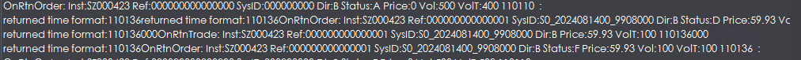

# 7.23、24Tracy

## 测量concurrentqueue的Push\_back和Pop分别从开始到结束的耗时，如下。

<figure><figcaption></figcaption></figure>

## 测量双vector加锁从锁获取到结束Notify的耗时，如下

<figure><figcaption></figcaption></figure>

## concurrentqueue测量push\_back从原加锁获取开始到原notify位置耗时，如下

<figure><figcaption></figcaption></figure>

## 测量concurrentqueue从push\_back前到pop后

平均值22毫秒？？中位数532纳秒，这个平均值受到间断的未知的100+ms和尤其显著的3.87s异常帧的影响很大。

<figure><figcaption></figcaption></figure>

## 原vector从push前到使用前

同样由于不可知原因有很多3.87s，影响平均值。并且这里因为连续framestart会增大3.87s数量且vector不能保证队列仅有一个元素，所以在进队元素1、元素2、元素3，出队元素1元素2元素3的情况下测的是元素1push前到元素3被使用前的延时。不准确。

<figure><figcaption></figcaption></figure>

## vector从push前到使用前

使用前对应无锁队列的pop成功后。由于vector方案队列长度经常超过一导致3.87s的异常帧占主导，无法得出有效数据，因此采取原子bool变量来控制队列长度不超过一（严格说来是Multidata类型的元素不超过1个），测量相应数据push\_back前到使用前的延时。平均数仍然被偶尔的3.87s给影响了，但中位数10μs和之前测量结果一致。

<figure><figcaption>
7.24
</figcaption></figure>

## 原vectorpush加锁前到使用前

<figure><figcaption></figcaption></figure>

## vectorpush加锁前到pop后（紧随）

<figure><figcaption></figcaption></figure>

## 3s+毛刺原因

start和end离得太近，虽然逻辑上是先end再start，由于cpu各核频率变化与同步关系，在几十纳秒内可能出现时间上的交错重排，导致tracy认为start接start出现3.87s毛刺。（根据log的message多次比对正常帧和异常帧得知）

## 使用dequeue\_bulk的结果

从push到使用前

<figure><figcaption></figcaption></figure>

删掉log结果

<figure><figcaption></figcaption></figure>

打点开始同一后单元素push到pop

<figure><figcaption></figcaption></figure>
